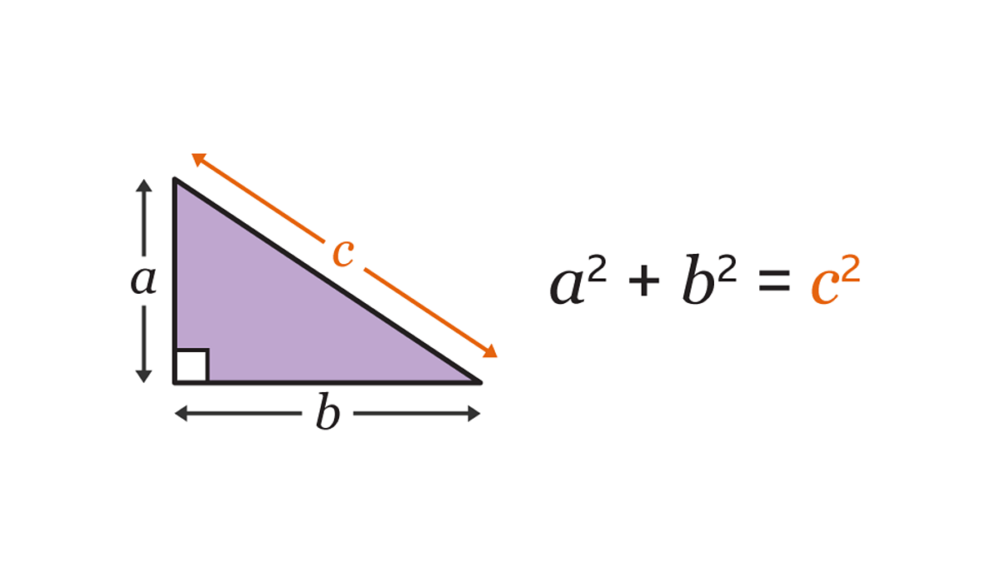

# Hello World! This is Travis Nguyen's Page

Hey! I am **Travis Nguyen**. I am a second-year *Computer Science* major with a minor in *Cognitive Science*. 

## Pythagorean Theorem
Pythagorean Theorem is the first theorem I was introduced to. 
### The equation 
a<sup>2</sup> + b<sup>2</sup> = c<sup>2</sup> 

As long as you have two sides of the right triangle, you can <ins>manipulate</ins> the equation to get the unknown side. 



## My Favorite Quote
Somethinhg that I love saying in particular weather is 

>"Why be in the rain when you can dance in it!"

I love to be optimistic about things and I enjoy hearing rainfall too. 


## C influence
I was taking a class that revolved around using C. The professor at the end used 
```return 0 ``` in their goodbye message and I've thought about that to this day. Also, a favorite code of mine would be ```print ``` just because it has helped me debug my code in a visual way. 

## LinkedIn


I have a feeling most people have used this. My *LinkedIn* is [here](https://www.linkedin.com/in/travis-nguyen17/)! 

## More About Me
If you still want to get to know me just a little bit, look at my [favorite quote](#my-favorite-quote). 

Also, there's more info located [here](info.md)!

### General Schedule for School
1. Wake up
2. Get ready for the day
3. Attend lecture/discussions
4. Eat food in between
5. Do work
6. Exercise
7. Do more work
8. Dinner
9. Go to sleep

### Interests
* Matcha 
* Hiking
* Scenic Views
* Spontaneous Hangouts
* Singing
* Dancing
* Traveling 

### Places I Have Been to
- [x] Mexico 
- [ ] Japan
- [ ] Korea
- [ ] France